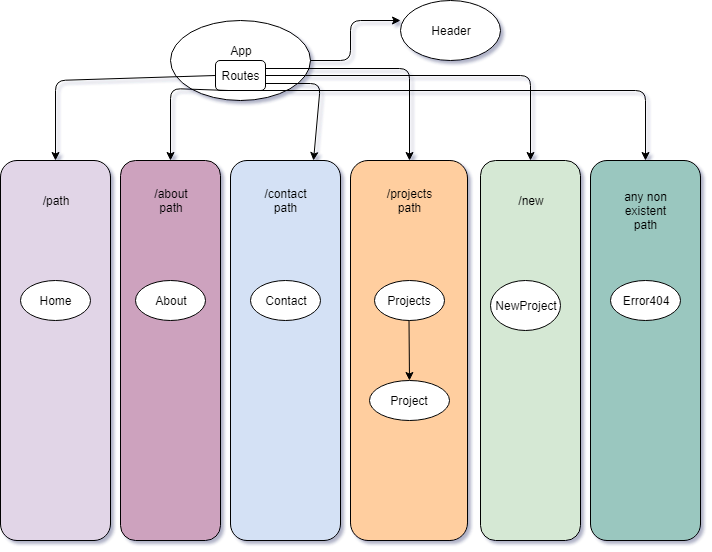

# _Portfolio React_

#### _A Webpage for Epicodus,React Week 1 project. 02.15.2019_

#### By _**Manasa Vesala**_

## Description

_A website for portfolio using react._

## Outline Diagram

## Layout of the Page

* _Separate application into components._
* _There will be a component with top header, about, home, contact,projects_
* _If you click on about it takes to about page._
* _If you click on Home it takes to Home page._
* _If you click on contact it takes to contact page._
* _If you click on projects it takes to projects page and shows all the projects._
* _If you click on add new project, it takes to a page consinst of form to add new project and after submit you can see that prohect in the projects page_
* _you can like a project if you like it._

## Setup/Installation Requirements

* _Install Node.js_
* _Clone this repository https://github.com/manasavesala/Portfolio-React.git_
* _Navigate to the project folder in the terminal._
* _In the terminal: Enter "npm install" to Install dependencies and plugins_ 
* _Type in "npm run start" to start the app in your Chrome browswer._
* _Open up your preferred web browswer and navigate to 'http://localhost:8080/'_

## Support and contact details

_Contact Manasa Vesala - vesalamanasa@gmail.com_

## Technologies Used

* _JavaScript_
* _node.js_
* _npm_
* _Webpack_
* _CSS_
* _VSCode_
* _Git_
* _GitHub_
* _HTML_

### License

*This software is licensed under the MIT license.*

Copyright (c) 2018 **_Manasa Vesala_**